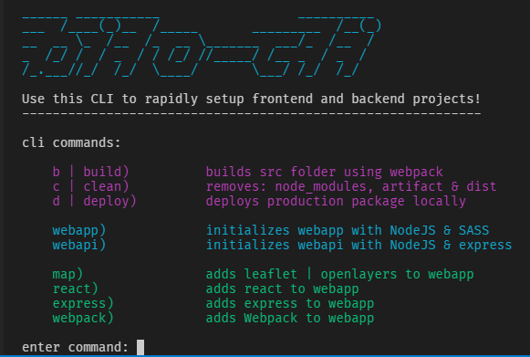

# bilo-cli

This is a repo containing scripts to automate various tasks for NodeJS projects.
These tasks have all been combined into a *CLI* (command line interface), called `bilo`.

>- Currently, there is only the functionality to create frontend projects
>- An item has been created for initialising server projects as well

## Quickstart

You can install the CLI on Windows & Linux based machines as follows:

### Install
- `git clone https://github.com/bilo-io/bilo-cli`
- `cd ./bilo-cli`
    - sh: `bash ./.shell/install.sh`
    - ps: `./.shell/install.ps1`

> Optional: 
> - by default, the cli is called `bilo`
> - you can give this CLI an alias (e.g. `my-cli`)
> - provide the alias as an argument: `bash ./.shell/install-bilo-cli.sh my-cli`

### Run

- `bilo`

## Usage

The CLI can be used to create NodeJS applications, where you can add Express, Webpack, React & Angular.
Below is an example for how to create a webapplication in a newly created, empty folder.

In an empty folder, such as `ExampleApp`:

- `mkdir ExampleApp`
- `cd ./ExampleApp`

Run the command

- `bilo` to bring up the menu
- Enter command: `app` ... initialises an app folder.

Alternatively, you can run the commands immediately, as follows:

- `bilo app`

For some commands there is also the shorthand notation:

- `bilo a`

## CLI Commands

Below is a full list of commands provided by the `bilo` CLI.

|command|effect|
|:-|:-|
|`a | app`|creates a [Node (v6)](https://nodejs.org) webapp|
|`b | build`|N/A|builds a production package using webpack|
|`c | clean`|N/A|cleans the directory, removing all generated folders, while leaving `src` and required files untouched|
|`d | deploy`|N/A|deploys the generated `artifact` to a local directory, simulating the prod environment|
|`express`|adds [Express](https://expressjs.com/), a minimalist web framework for NodeJS|
|`ng2`|adds [Angular 2](http://angular.io), a framework for dynamic web apps|
|`react`|adds [ReactJS](https://facebook.github.io/react/), a library for building frontend web applications|
|`webpack`|adds [Webpack](https://webpack.github.io)|a module bundler for javascript projects|